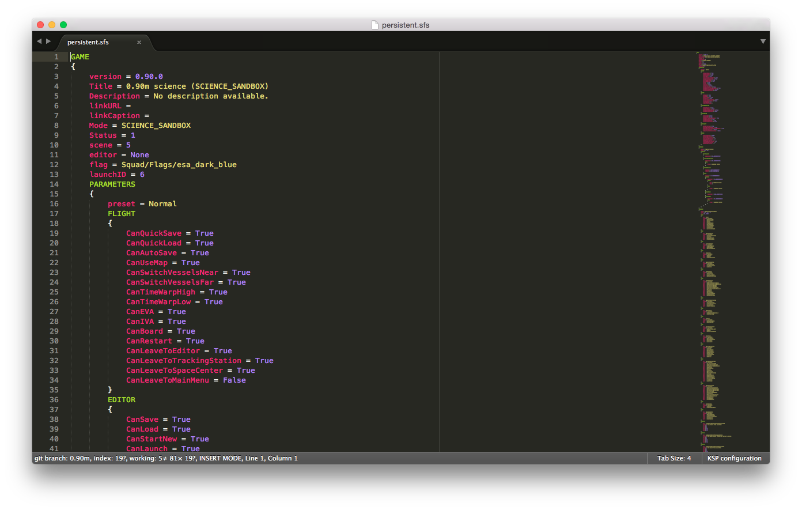
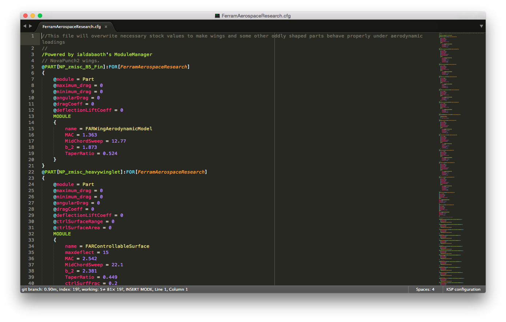

# Kerbal Space Program Configuration Syntax

This is a `.tmLanguage` specification for configuration files in [Kerbal Space Program](https://kerbalspaceprogram.com/), including `persistent.sfs` and `part.cfg` files.
I developed this for syntax highlighting when editing these files in [Sublime Text](http://www.sublimetext.com/).

It *mostly* supports ModuleManager syntax:

Note: this screenshot contains data from [Ferram-Aerospace-Research](https://github.com/ferram4/Ferram-Aerospace-Research/blob/master/GameData/FerramAerospaceResearch/FerramAerospaceResearch.cfg) by [ferram4](https://github.com/ferram4), licenced under GNU.

`KSP configuration.JSON-tmLanguage` is the JSON "source" for the specification, which can be "compiled" into the XML `.tmLanguage` type with [AAAPackageDev](https://github.com/SublimeText/AAAPackageDev).
All the work is done in the JSON.

## Installation
Installation through [Package Control](https://packagecontrol.io/packages/Kerbal%20Space%20Program%20Configuration%20Syntax) is preferred.

## Contributing
Please [file an issue](https://github.com/NathanJang/KSP-tmLanguage/issues) or fork if you have any suggestions!
